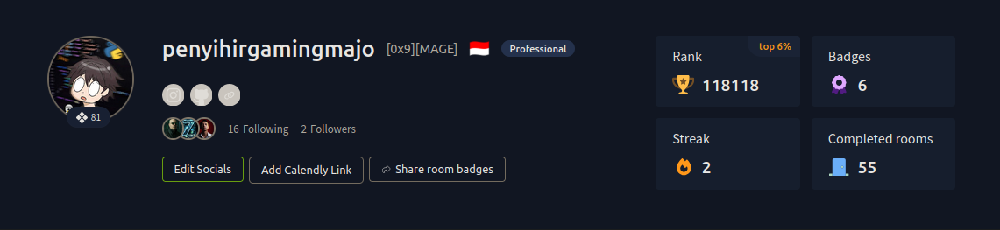

<!-- Header / Introduction -->
<h1 align="center">Hi 👋, I'm Wildan Aditya</h1>
<h3 align="center">Backend Engineer (Laravel • Go) | Web App Pentesting Enthusiast | TryHackMe Player</h3>

  
  
  
  

---

## 🧑‍💻 About Me

I'm a **Backend Developer** specializing in **Laravel (PHP)** and **Golang**.  
I build scalable APIs, clean architectures, and high-performance microservices.

On the side, I sharpen my **Web Application Penetration Testing** skills — understanding vulnerabilities from both a developer's and an attacker's perspective.  
I'm also an active **TryHackMe** player, constantly learning and solving CTF challenges to level up my cybersecurity game.

> 🔭 Currently working on: Backend projects with Laravel & Go  
> 🌱 Learning more about: Advanced pentesting, cloud security, and DevSecOps  
> 💬 Ask me about: Laravel, Golang, basic web security  
> ⚡ Fun fact: I enjoy breaking things just to fix them better 😄

---

## 🌐 Connect with me

---

## 🛠️ Tech Stack & Tools

### 👨‍💻 Backend

### 🌐 Frontend

### 🚀 Deployment & Tools

---

## 📊 GitHub Analytics

  
  

  

---

## 🎯 TryHackMe Journey

  <i>“Understanding the attacker's mindset makes me a stronger defender and a better developer.”</i>

---

## 🏆 Top Contributed Repositories

---

## 📌 Pinned Projects

Check out some of my work:

- 🔗 [Repo 1](https://github.com/AdityaWilldan) – *Description coming soon*  
- 🔗 [Repo 2](https://github.com/AdityaWilldan) – *Description coming soon*

> *I'm actively populating my GitHub — stay tuned for more backend & security projects!*

---

  

<!-- Proudly created with GPRM (https://gprm.itsvg.in) + custom enhancements -->
